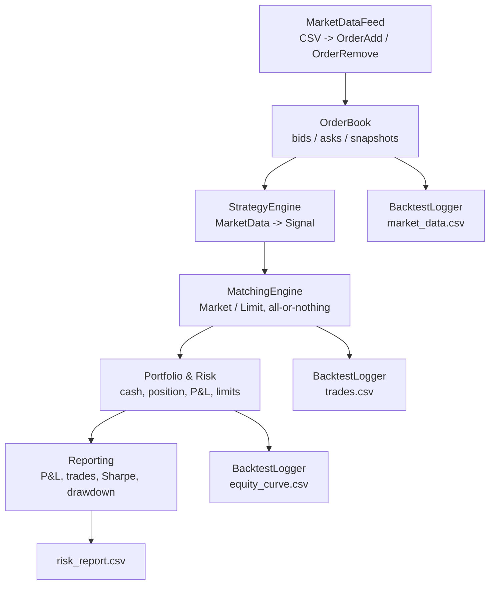

# C++17 Simulated Trading Platform

**Event-driven trading simulator with order book reconstruction, strategy execution, portfolio accounting, and post-trade risk reporting.**

*Academic project - Paris Dauphine University - C++ for Quantitative Finance*

https://cpp-simulated-trading-platform.streamlit.app/
---

## Overview

This project simulates a complete trading workflow in C++17, from market event ingestion to post-trade reporting.

The engine reads order book events from CSV files, maintains a limit order book, rebuilds `MarketData` snapshots, routes those snapshots to a polymorphic trading strategy, executes strategy orders through a matching engine, updates portfolio state, and exports console and CSV reports.

**Key Features:**
- CSV market event ingestion with `ADD` and `REMOVE` events
- Limit order book with price-time priority
- Market data snapshot generation after each book update
- Pluggable trading strategies through a shared `Strategy` interface
- Market and limit order matching with all-or-nothing execution
- Portfolio accounting with cash, position, realized P&L, and total P&L
- Pre-trade position risk checks
- Risk metrics including Sharpe ratio, volatility, drawdown, win rate, and rejects
- CSV exports for market data, trades, equity curve, and final risk report
- Optional Python plotting script for visual analysis

---

## Architecture



**Main flow:**

1. `MarketDataFeed` reads `data/test_events.csv` line by line.
2. `OrderBook` applies `ADD` and `REMOVE` events, sorts price levels using price-time priority, and generates a snapshot.
3. `StrategyEngine` forwards each snapshot to the selected polymorphic strategy.
4. A `BUY` or `SELL` signal becomes a `Market` or `Limit` order.
5. `MatchingEngine` executes the order all-or-nothing against the current book.
6. `Portfolio` updates cash, position, P&L, and applies the pre-trade position limit.
7. `Reporting` prints final metrics and writes a CSV risk report.

---

## Quick Start

### Build

Requirements:
- CMake 3.15+
- A C++17 compiler

```bash
cmake -S . -B build
cmake --build build
```

### Run Tests

```bash
ctest --test-dir build --output-on-failure
```

The tests use Google Test. CMake downloads GoogleTest automatically with `FetchContent` inside the build directory.

### Run a Simulation

Default run:

```bash
./build/trading_sim
```

Run with an explicit dataset and strategy:

```bash
./build/trading_sim data/test_events.csv momentum
./build/trading_sim data/test_events.csv mean_reversion
./build/trading_sim data/test_events.csv bollinger
./build/trading_sim data/test_events.csv ma_cross
```

### Launch Streamlit Dashboard

The dashboard is written in Python with Streamlit, but the trading engine remains the compiled C++ executable. Streamlit runs `./build/trading_sim` through `subprocess`, then reads the CSV files generated in `output/`.

```bash
pip install -r requirements.txt
streamlit run streamlit_app/app.py
```

Dashboard controls include:

- dataset and strategy selection
- C++ build and simulation run buttons
- equity, P&L, position, drawdown, market data, and trade visualizations
- final risk report and CSV download views

---

## Outputs

Generated files are written to `output/`. They are included in this repository as example outputs and are regenerated on each run:

- `market_data.csv`: reconstructed market snapshots
- `trades.csv`: strategy order executions
- `equity_curve.csv`: equity, P&L, and position over time
- `risk_report.csv`: final performance and risk metrics

Generate plots from the CSV outputs:

```bash
python3 scripts/plot_results.py --input output --out output/plots
```

The plotting script produces:

- `equity_curve.png`
- `pnl.png`
- `market_and_trades.png`
- `position.png`

The `results/` directory contains compact reference exports that are useful to keep under version control:

- `strategy_comparison.csv`: summary comparison across strategies
- `momentum_risk_report.csv`: final report for the reference run `data/test_events.csv momentum`

---

## Datasets

Available input files:

- `data/test_events.csv`: main project dataset
- `data/trend_events.csv`: small upward-trend teaching scenario
- `data/mean_reversion_events.csv`: small mean-reversion teaching scenario

Expected CSV format:

```csv
timestamp,event_type,order_id,side,price,quantity
1700000001,ADD,1001,BID,42500.00,5
1700000002,ADD,1002,ASK,42510.00,3
1700000003,REMOVE,1001,,,
```

Core event and data types:

- `OrderAdd`: `timestamp`, `order_id`, `side`, `price`, `quantity`
- `OrderRemove`: `timestamp`, `order_id`
- `MarketData`: generated by `OrderBook`, with `timestamp`, `best_bid`, `best_ask`, `last_price`, and `volume`
- `Order`: strategy order with `side`, `OrderType`, `price`, and `quantity`
- `Trade`: execution produced by the matching engine

The feed does not provide market snapshots directly. Snapshots are rebuilt by the order book after each update.

---

## Simulation Assumptions

The project simulates a single financial instrument.

`ADD` events represent external orders feeding the book. If an `ADD` crosses the opposite best price, the book executes it immediately against available liquidity before adding any remaining quantity. This prevents impossible states such as `best_bid > best_ask`.

Trades caused by feed events are used to keep the book consistent and update `last_price`. Trades exported to `trades.csv` correspond only to strategy order executions.

`MarketData.volume` represents the size of the latest observed execution, not cumulative volume since the beginning of the simulation.

A `REMOVE` event can arrive after a feed order has already been executed. In that case, it is ignored silently. A true `REMOVE` for an unknown order id is still reported with a warning.

Risk parameters are fixed in `main.cpp`: initial cash is 1,000,000 and the maximum absolute position is 10.

---

## Strategies

All strategies inherit from the abstract `Strategy` interface.

- `momentum`: compares short and long moving averages. It emits `BUY` when the fast average is above the slow average, and `SELL` in the opposite case.
- `mean_reversion`: computes a rolling z-score. It emits `SELL` when the price is high relative to its mean, and `BUY` when it is low.
- `bollinger`: mean-reversion variant based on Bollinger Bands.
- `ma_cross`: longer moving-average crossover, useful for comparing results.

Current strategy parameters are defined in `make_strategy()` in `src/Strategy.cpp`.

---

## Matching And Risk

The matching engine supports:

- `Market` and `Limit` orders
- all-or-nothing execution for strategy orders
- price-time priority
- one or more `Trade` objects when an order crosses multiple price levels

The book also handles feed `ADD` events that cross the market. They consume opposite-side liquidity before any remaining quantity is added to the book. This prevents snapshots with a negative spread.

The portfolio applies an absolute position limit before each strategy order. If the limit would be exceeded, the order is rejected and the `Risk rejects` counter is incremented.

---

## Example Result

Command:

```bash
./build/trading_sim data/test_events.csv momentum
```

Observed final output on the provided dataset:

```text
Final mark price            : 100.08
Final position              : -8
Cash                        : 1000797.42
Realized P&L                : -3.64
Total P&L                   : -3.22
Gross exposure              : 800.64
Net exposure                : -800.64
Number of trades            : 117
Sharpe Ratio annualized     : -0.3480
Annualized volatility       : 0.00000948
Max drawdown                : 0.00000818
Win rate                    : 0.3860
Average win                 : 0.1987
Average loss                : -0.2289
Risk rejects                : 76
Liquidity rejects           : 2
```

On this run, no snapshot with `best_bid > best_ask` is produced.

---

## Strategy Comparison

Comparison on `data/test_events.csv`:

| Strategy | Trades | Total P&L | Final position | Risk rejects | Liquidity rejects | Annualized Sharpe |
| --- | ---: | ---: | ---: | ---: | ---: | ---: |
| `momentum` | 117 | -3.22 | -8 | 76 | 2 | -0.3480 |
| `mean_reversion` | 142 | -16.40 | 10 | 37 | 33 | -1.5474 |
| `bollinger` | 132 | -16.96 | 6 | 6 | 22 | -1.7399 |
| `ma_cross` | 113 | -1.94 | -8 | 97 | 0 | -0.4443 |

These strategies are intentionally simple. Their purpose is to demonstrate the architecture, polymorphism, matching, risk checks, and reporting pipeline. They are not optimized to maximize P&L on the provided dataset.

---

## Add a Strategy

1. Create a class that inherits from `Strategy` in `include/Strategy.hpp`.
2. Implement `on_market_data(const MarketData&)`, `name()`, `preferred_order_type()`, and `quantity()`.
3. Add the implementation in `src/Strategy.cpp`.
4. Add an alias in `make_strategy()`.
5. Build and run:

```bash
cmake --build build
./build/trading_sim data/test_events.csv new_alias
```

---

## Project Structure

```text
.
├── CMakeLists.txt
├── README.md
├── data/
│   ├── test_events.csv
│   ├── trend_events.csv
│   └── mean_reversion_events.csv
├── results/
│   ├── strategy_comparison.csv
│   └── momentum_risk_report.csv
├── include/
│   ├── Events.hpp
│   ├── MarketDataFeed.hpp
│   ├── OrderBook.hpp
│   ├── MatchingEngine.hpp
│   ├── Strategy.hpp
│   ├── StrategyEngine.hpp
│   ├── Portfolio.hpp
│   ├── Reporting.hpp
│   └── ...
├── src/
│   ├── main.cpp
│   └── ...
├── tests/
│   └── test_core.cpp
└── scripts/
    └── plot_results.py
```
