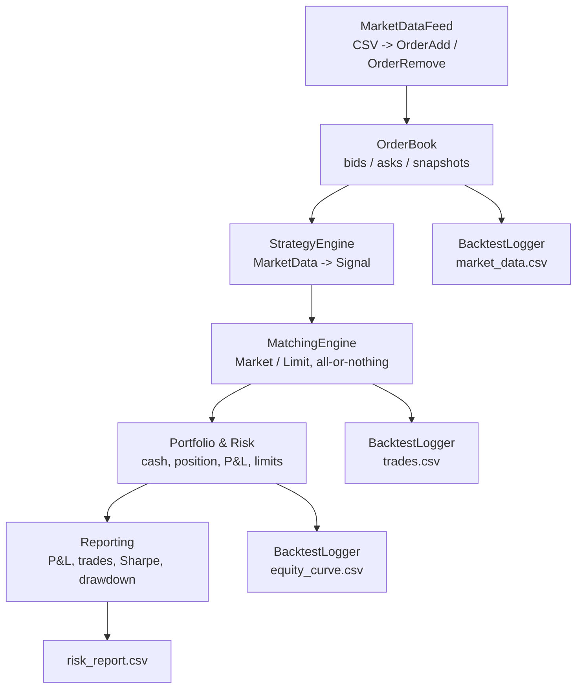

# Plateforme de Trading Simulee en C++17

Projet final de C++ pour la finance quantitative : simulation d'une plateforme de trading complete, depuis la lecture d'un flux de marche jusqu'au reporting post-trade.

Le programme lit des evenements de carnet d'ordres depuis un CSV, maintient un `OrderBook`, genere des snapshots `MarketData`, applique une strategie de trading, execute les ordres via un moteur de matching, met a jour le portefeuille, puis produit des rapports console et CSV.

## Architecture



Flux principal :

1. `MarketDataFeed` lit `data/test_events.csv` ligne par ligne.
2. `OrderBook` applique les `ADD` et `REMOVE`, trie les prix en price-time priority et genere un snapshot.
3. `StrategyEngine` transmet le snapshot a une strategie polymorphique.
4. Un signal `BUY` ou `SELL` devient un ordre `Market` ou `Limit`.
5. `MatchingEngine` execute l'ordre en tout-ou-rien contre le carnet.
6. `Portfolio` met a jour cash, position, P&L et applique la limite de position pre-trade.
7. `Reporting` affiche les metriques finales et ecrit un rapport CSV.

## Build

Prerequis : CMake 3.15+ et un compilateur C++17.

```bash
cmake -S . -B build
cmake --build build
```

Lancer les tests :

```bash
ctest --test-dir build --output-on-failure
```

Les tests sont ecrits avec Google Test. CMake telecharge GoogleTest automatiquement via `FetchContent` dans le dossier de build.

## Utilisation

Simulation par defaut :

```bash
./build/trading_sim
```

Simulation avec fichier CSV et strategie explicites :

```bash
./build/trading_sim data/test_events.csv momentum
./build/trading_sim data/test_events.csv mean_reversion
./build/trading_sim data/test_events.csv bollinger
./build/trading_sim data/test_events.csv ma_cross
```

Les fichiers generes sont dans `output/`. Ce dossier est ignore par Git car ces fichiers sont regenerables :

- `market_data.csv` : snapshots de marche.
- `trades.csv` : trades executes par la strategie.
- `equity_curve.csv` : evolution de l'equity, du P&L et de la position.
- `risk_report.csv` : metriques finales.

Generer des graphiques a partir des CSV :

```bash
python3 scripts/plot_results.py --input output --out output/plots
```

Le script produit :

- `equity_curve.png`
- `pnl.png`
- `market_and_trades.png`
- `position.png`

Le dossier `results/` contient seulement des exports courts et utiles a versionner :

- `strategy_comparison.csv` : comparaison synthetique des strategies.
- `momentum_risk_report.csv` : rapport final du run de reference `data/test_events.csv momentum`.

Jeux de donnees disponibles :

- `data/test_events.csv` : dataset principal du projet.
- `data/trend_events.csv` : petit scenario pedagogique de tendance haussiere.
- `data/mean_reversion_events.csv` : petit scenario pedagogique oscillant autour d'une moyenne.

## Evenements

Format CSV attendu :

```csv
timestamp,event_type,order_id,side,price,quantity
1700000001,ADD,1001,BID,42500.00,5
1700000002,ADD,1002,ASK,42510.00,3
1700000003,REMOVE,1001,,,
```

Types manipules :

- `OrderAdd` : `timestamp`, `order_id`, `side`, `price`, `quantity`.
- `OrderRemove` : `timestamp`, `order_id`.
- `MarketData` : genere par `OrderBook`, contient `timestamp`, `best_bid`, `best_ask`, `last_price`, `volume`.
- `Order` : ordre de strategie avec `side`, `OrderType`, `price`, `quantity`.
- `Trade` : execution produite par le matching engine.

Le feed ne fournit pas directement les snapshots de marche : ils sont reconstruits par le carnet apres chaque mise a jour.

## Hypotheses de simulation

Le projet simule un seul instrument financier.

Les `ADD` du feed representent des ordres externes qui alimentent le carnet. Si un `ADD` croise le meilleur prix oppose, le carnet l'execute immediatement contre la liquidite disponible avant d'ajouter le reliquat eventuel. Cela evite les etats impossibles avec `best_bid > best_ask`.

Les trades provoques par le feed servent a maintenir un carnet coherent et a mettre a jour `last_price`. Les trades exportes dans `trades.csv` correspondent uniquement aux executions des ordres de strategie.

Le champ `MarketData.volume` represente le volume de la derniere execution observee, pas un volume cumule depuis le debut de la simulation.

Un `REMOVE` peut arriver apres qu'un ordre du feed a deja ete execute. Dans ce cas, il est ignore silencieusement. Un vrai `REMOVE` sur un identifiant jamais vu reste signale par un warning.

Les parametres de risque sont fixes dans `main.cpp` : cash initial de 1 000 000 et position maximale absolue de 10.

## Strategies

Toutes les strategies heritent de l'interface abstraite `Strategy`.

- `momentum` : compare deux moyennes mobiles courtes et longues. Signal `BUY` si la moyenne rapide depasse la lente, `SELL` dans le cas inverse.
- `mean_reversion` : calcule un z-score sur une fenetre glissante. Signal `SELL` si le prix est trop haut par rapport a sa moyenne, `BUY` s'il est trop bas.
- `bollinger` : variante mean reversion avec bandes de Bollinger.
- `ma_cross` : moving average crossover plus long, utile pour comparer les resultats.

Les parametres actuels sont definis dans `make_strategy()` dans `src/Strategy.cpp`.

## Matching et risque

Le matching respecte :

- ordres `Market` et `Limit`;
- execution tout-ou-rien pour les ordres de strategie;
- price-time priority;
- generation d'un ou plusieurs `Trade` si l'ordre traverse plusieurs niveaux.

Le carnet traite aussi les `ADD` du feed qui croisent le marche : ils consomment la liquidite opposee avant qu'un reliquat eventuel soit ajoute au book. Cela evite les snapshots avec spread negatif.

Le portefeuille applique une limite de position absolue avant chaque ordre de strategie. Si la limite est depassee, l'ordre est rejete et le compteur `Risk rejects` est incremente.

## Exemple de resultat

Commande :

```bash
./build/trading_sim data/test_events.csv momentum
```

Sortie finale observee sur les donnees fournies :

```text
Final mark price            : 100.08
Final position              : -8
Cash                        : 1000797.42
Realized P&L                : -3.64
Total P&L                   : -3.22
Gross exposure              : 800.64
Net exposure                : -800.64
Number of trades            : 117
Sharpe Ratio annualized     : -0.3480
Annualized volatility       : 0.00000948
Max drawdown                : 0.00000818
Win rate                    : 0.3860
Average win                 : 0.1987
Average loss                : -0.2289
Risk rejects                : 76
Liquidity rejects           : 2
```

Sur ce run, aucun snapshot avec `best_bid > best_ask` n'est produit.

## Comparaison des strategies

Comparaison sur `data/test_events.csv` :

| Strategie | Trades | Total P&L | Position finale | Risk rejects | Liquidity rejects | Sharpe annualise |
| --- | ---: | ---: | ---: | ---: | ---: | ---: |
| `momentum` | 117 | -3.22 | -8 | 76 | 2 | -0.3480 |
| `mean_reversion` | 142 | -16.40 | 10 | 37 | 33 | -1.5474 |
| `bollinger` | 132 | -16.96 | 6 | 6 | 22 | -1.7399 |
| `ma_cross` | 113 | -1.94 | -8 | 97 | 0 | -0.4443 |

Ces strategies sont volontairement simples et servent surtout a demontrer l'architecture polymorphique, le matching et le reporting. Elles ne sont pas optimisees pour maximiser le P&L sur le dataset fourni.

## Ajouter une strategie

1. Creer une classe qui herite de `Strategy` dans `include/Strategy.hpp`.
2. Implementer `on_market_data(const MarketData&)`, `name()`, `preferred_order_type()` et `quantity()`.
3. Ajouter l'implementation dans `src/Strategy.cpp`.
4. Ajouter un alias dans `make_strategy()`.
5. Compiler puis lancer :

```bash
cmake --build build
./build/trading_sim data/test_events.csv nouvel_alias
```

## Structure

```text
.
├── CMakeLists.txt
├── README.md
├── data/
│   ├── test_events.csv
│   ├── trend_events.csv
│   └── mean_reversion_events.csv
├── results/
│   ├── strategy_comparison.csv
│   ├── momentum_risk_report.csv
│   └── README.md
├── include/
│   ├── Events.hpp
│   ├── MarketDataFeed.hpp
│   ├── OrderBook.hpp
│   ├── MatchingEngine.hpp
│   ├── Strategy.hpp
│   ├── StrategyEngine.hpp
│   ├── Portfolio.hpp
│   ├── Reporting.hpp
│   └── ...
├── src/
│   ├── main.cpp
│   └── ...
├── tests/
│   └── test_core.cpp
└── scripts/
    └── plot_results.py
```
